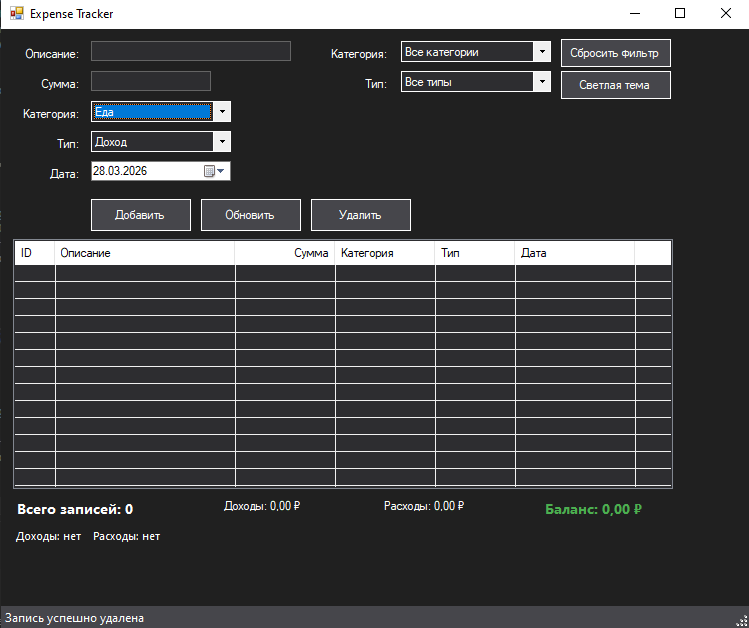

# 💸 Expense Tracker - Personal Finance Manager

[](https://github.com/)
[](https://docs.microsoft.com/en-us/cpp/dotnet/dotnet-programming-with-cpp-cli)
[](https://docs.microsoft.com/en-us/dotnet/desktop/winforms/)
[](https://opensource.org/licenses/MIT)

A powerful and elegant desktop application for tracking personal finances. Monitor your income, expenses, and financial health with an intuitive interface, dark/light theme support, and comprehensive filtering capabilities.



## ✨ Features

- **Complete Transaction Management**
  - Add, edit, and delete income/expense records
  - Categorize transactions (Food, Transport, Entertainment, Health, Shopping, Other)
  - Set custom dates for each transaction
  - Automatic timestamp tracking for created records

- **Smart Financial Overview**
  - Real-time balance calculation (Income - Expenses)
  - Color-coded transactions (Green for Income, Red for Expenses)
  - Total income and expense summaries
  - Category-wise statistical breakdown

- **Advanced Filtering & Sorting**
  - Filter by category (Food, Transport, etc.)
  - Filter by transaction type (Income/Expense)
  - Sort any column by clicking headers
  - Combined filter application

- **User-Friendly Interface**
  - Clean, modern Windows Forms design
  - Dark/Light theme toggle with persistent preference
  - Double-click to edit any transaction
  - Status bar with operation feedback
  - Intuitive input validation

- **Data Persistence**
  - Automatic saving to `transactions.txt`
  - Loads previous sessions automatically
  - Robust error handling

## 🚀 Getting Started

### Prerequisites

- Windows operating system (7/8/10/11)
- [Visual Studio](https://visualstudio.microsoft.com/) 2019 or later with:
  - Desktop development with C++ workload
  - .NET desktop development workload
  - C++/CLI support

### Installation

1. **Clone the repository**
   ```bash
   git clone https://github.com/yourusername/expense-tracker.git
   cd expense-tracker
